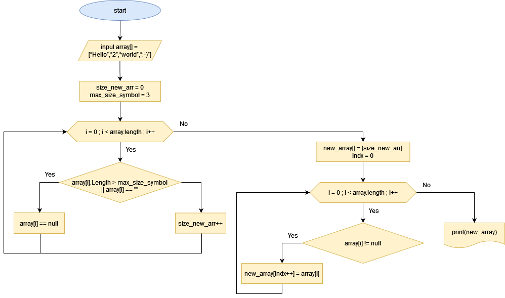

# Итоговая контрольная работа по основному блоку на языке C#

## Задача: 
Написать программу, которая из имеющегося массива строк формирует новый массив из строк, длина которых меньше, либо равна 3 символам. Первоначальный массив можно ввести с клавиатуры, либо задать на старте выполнения алгоритма. При решении не рекомендуется пользоваться коллекциями, лучше обойтись исключительно массивами.

> Примеры:

> [“Hello”, “2”, “world”, “:-)”] → [“2”, “:-)”]

>[“1234”, “1567”, “-2”, “computer science”] → [“-2”]

>[“Russia”, “Denmark”, “Kazan”] → []

## Диаграмма работы

## Описание решения:
0. Начало работы
1. Получаем входной массив строк array[]
2. Задаём переменную size_new_arr = 0 для хранения длины нового массива new_array[] 
3. В цикле проверяем входной массив по элементно на условие длины строки в записе не более 3 символов и не пустое значение:
    * если длина строки больше 3 символа  или пустая то заполняем этот элемент значением *null*
    * если длина равна или меньше 3 увеличиваем длину нового массива size_new_arr на +1
4. После окончания цикла перебора элементов создаём новый массив new_array[] с длиной size_new_arr
5. В цикле перебираем элементы массива array и если элемент массива не равен *null* то записываем значение в новый массив new_array
6. Выводим получившийся новый массив new_array
